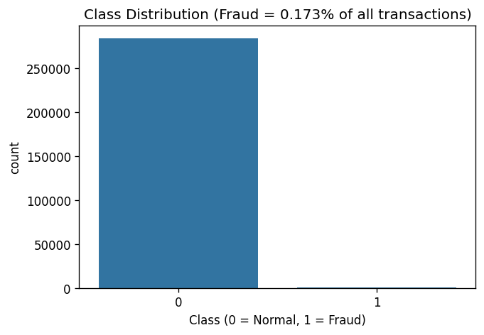
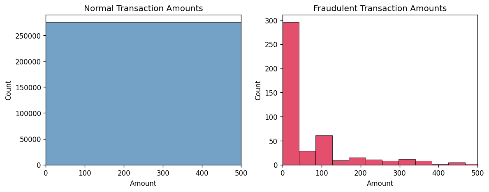
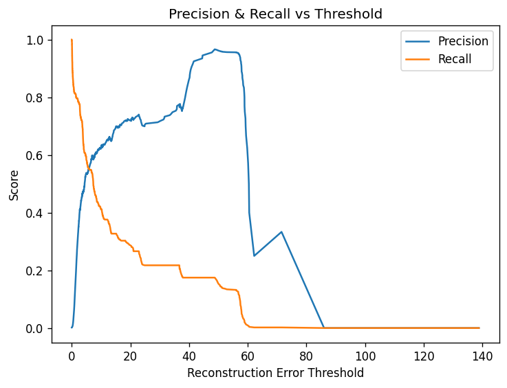

## Results

| Model | ROC-AUC | Precision | Recall | F1 |
|---|---|---|---|---|
| Autoencoder | 0.9246 | 0.597 | 0.539 | 0.566 |
| Isolation Forest (threshold-tuned) | 0.9451 | 0.226 | 0.325 | 0.267 |

**Why one performed better than the other:**

Isolation Forest actually has a slightly better ROC-AUC (0.9451 vs 0.9246), meaning it's marginally better at *ranking* transactions from most to least suspicious in general. However, once both models are forced to commit to an actual threshold and make real fraud/not-fraud decisions, the autoencoder wins clearly — more than double the F1 score (0.566 vs 0.267). This suggests Isolation Forest's straight, one-feature-at-a-time splits struggle to draw a sharp, decisive boundary when fraud depends on *combinations* of features together, while the autoencoder — being a neural network — can learn these non-linear, multi-feature relationships and translate them into a more confident decision boundary.

## Data Overview

Fraud makes up only 0.173% of all transactions (492 out of 284,807). This
extreme imbalance is why accuracy is a meaningless metric for this problem
— a model that predicts "not fraud" every single time would still be
99.8% accurate while catching zero fraud. It's also why the project uses
an unsupervised approach (autoencoder) rather than a standard classifier,
which would struggle to learn from so few positive examples.

Comparing transaction amounts for normal vs. fraudulent transactions shows
they follow a broadly similar shape — both skew toward small amounts, with
fraud not concentrated at unusually high or low values. This rules out a
naive rule like "flag any transaction over ₹X" as a viable detection
strategy, and motivates using a model that can learn deeper, multi-feature
patterns instead of relying on transaction amount alone.

## Results

| Model | ROC-AUC | Precision | Recall | F1 |
|---|---|---|---|---|
| Autoencoder | 0.9246 | 0.597 | 0.539 | 0.566 |
| Isolation Forest (threshold-tuned) | 0.9451 | 0.226 | 0.325 | 0.267 |

This chart shows the precision/recall tradeoff across every possible
reconstruction-error threshold. As the threshold increases, precision
rises (fewer false alarms) but recall falls (more missed fraud) — the
chosen operating threshold (4-line intersection point, maximizing F1)
balances the two rather than optimizing either in isolation.

**Why one performed better than the other:**

Isolation Forest actually has a slightly better ROC-AUC (0.9451 vs 0.9246), meaning it's marginally better at *ranking* transactions from most to least suspicious in general. However, once both models are forced to commit to an actual threshold and make real fraud/not-fraud decisions, the autoencoder wins clearly — more than double the F1 score (0.566 vs 0.267). This suggests Isolation Forest's straight, one-feature-at-a-time splits struggle to draw a sharp, decisive boundary when fraud depends on *combinations* of features together, while the autoencoder — being a neural network — can learn these non-linear, multi-feature relationships and translate them into a more confident decision boundary.

**Recommendation:** the autoencoder, given its stronger precision/recall trade-off at a real operating threshold — which is what actually matters in a deployed fraud system, not just ranking ability.
